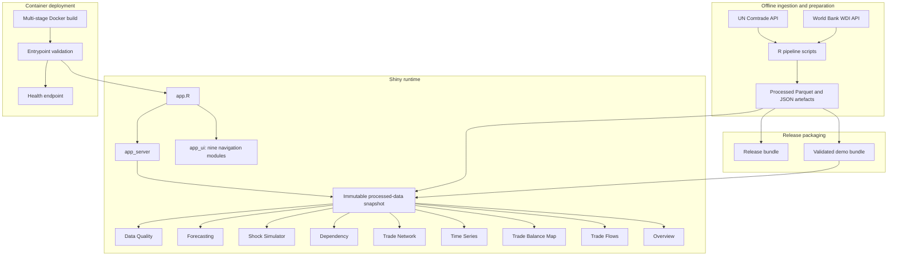

# Global Trade & Supply Chain Explorer

> An interactive R Shiny platform for exploring HS Chapter 85 trade, bilateral commodity flows, network structure, import concentration, deterministic supply-chain shocks, and fixture-labelled monthly forecasting.

## Overview

The **Global Trade & Supply Chain Explorer** is a modular analytics application built with **R and Shiny**. It combines global country-year trade totals with a selected bilateral HS4 analytical universe, enriches the data with World Bank indicators, and presents the results through nine interactive modules.

The application supports executive-level trade analysis, bilateral flow exploration, trade-balance mapping, commodity time series, network centrality, import-dependency diagnostics, and deterministic supplier-shock scenarios. Its forecasting architecture supports naïve, ETS, ARIMA, and optional Prophet workflows; the current public/demo forecasting path is explicitly labelled as synthetic fixture data rather than live production forecasting.

This repository is best described as a **portfolio-grade release candidate**: analytically substantial, modular, tested, containerised, and designed for offline/public demo deployment, while retaining clear limitations around bilateral scope, forecast data, hosting resources, and scenario interpretation.

## Highlights

- **Nine-module Shiny application** covering overview, flows, map, time series, network, dependency, shocks, forecasting, and data quality.
- **Global HS-85 country analytics** covering 177 economies from 2019–2024.
- **Selected bilateral HS4 universe** with 87,609 enriched detailed records across 20 reporters, 20 partners, and 20 HS4 categories.
- **Interactive visualisation stack** using Plotly, Leaflet, networkD3, DT, and igraph.
- **Deterministic shock simulation** with supplier substitution, residual unmet-import accounting, and optional propagation.
- **Reproducible engineering workflow** with `renv`, automated tests, CI workflows, and a non-root Docker runtime.

## Application Modules

| Module | What it provides |
|---|---|
| **Executive Overview** | Country-year KPIs, trade rankings, composition views, balances, macro comparisons, and downloads. |
| **Trade Flows** | Bilateral HS4 filtering, Sankey diagrams, composition views, time series, reporter-partner matrices, and CSV exports. |
| **Trade Balance Map** | Leaflet choropleths of country-level trade totals and balances, rankings, profiles, and trend views. |
| **Time Series & Commodity Analysis** | Global, single-economy, comparison, and detailed scopes with YoY growth, index transforms, movers, treemaps, and tables. |
| **Trade Network** | Directed trade graphs, PageRank and other centrality measures, corridor analysis, diagnostics, and GraphML/CSV downloads. |
| **Dependency Explorer** | Supplier concentration, HHI, top-supplier shares, effective supplier counts, heatmaps, rankings, and trends. |
| **Shock Simulator** | Supplier shock configuration, substitution, residual exposure, optional propagation, impact rankings, maps, and downloads. |
| **Forecasting** | Model comparison, backtests, residual diagnostics, point forecasts, and 80%/95% intervals using fixture-labelled monthly data. |
| **Data Quality** | Pipeline status, validation outputs, coverage summaries, and performance notices. |

## Data Coverage

### Verified Local Analytical Snapshot

| Layer | Coverage | Records |
|---|---:|---:|
| Global enriched HS-85 trade | 177 economies, 2019–2024 | 1,955 |
| Country-year analytical table | 177 economies | 981 |
| Detailed bilateral HS4 cube | 20 reporters × 20 partners × 20 HS4 categories, 2019–2024 | 87,609 |
| WDI wide table | Production analytical universe | 1,050 |
| WDI long table | Production analytical universe | 4,200 |
| Monthly forecasting table | Fixture/live pipeline context | 864 |

### Data Sources

- **UN Comtrade** — annual HS trade ingestion and monthly pipeline architecture.
- **World Bank World Development Indicators** — GDP, population, CPI, and macroeconomic context.
- **Natural Earth** — simplified world geometries used by the map module.
- **Local Parquet and JSON bundles** — offline application runtime and public/demo deployment.

The running Shiny application uses processed local data and does **not** require live Comtrade or WDI API access during a user session.

## Architecture



### Runtime Design

1. Offline ingestion scripts retrieve and standardise Comtrade and WDI data.
2. Processed artefacts are written as Parquet and JSON files.
3. `app.R` loads configuration, sources the R modules, and starts Shiny.
4. `app_server()` loads one processed-data snapshot and shares it across all modules.
5. Runtime profiles control demo, public, read-only, diagnostic, and scenario-write behaviour.
6. Docker validates the release bundle before starting the Shiny process.

## Technology Stack

### Language and Application Framework

- R 4.6.1 recommended
- Shiny
- bslib

### Data Engineering

- data.table
- arrow / Parquet
- fst
- jsonlite
- yaml
- httr2
- memoise
- cachem

### Visualisation and Analysis

- Plotly
- Leaflet
- networkD3 for Sankey diagrams
- DT
- igraph
- sf
- rnaturalearth

### Forecasting

- forecast
- Optional Prophet integration

### Quality and Deployment

- testthat
- renv
- Docker
- tini
- GitHub Actions

## Analytical Methods

### Trade Balance

\[
\text{Trade Balance} = \text{Exports} - \text{Imports}
\]

### Year-on-Year Growth

For consecutive valid years with a non-zero prior value:

\[
\text{YoY Growth}_{t}
=
\frac{x_t - x_{t-1}}{x_{t-1}} \times 100
\]

### Indexed Series

\[
\text{Index}_{t}
=
100 \times \frac{x_t}{x_{baseline}}
\]

The baseline is the first valid positive observation in the selected period.

### Supplier Concentration

For supplier shares \(s_i\):

\[
\text{HHI} = \sum_i s_i^2
\]

\[
\text{Effective Suppliers} = \frac{1}{\text{HHI}}
\]

The dependency module also reports top-one and top-three supplier shares.

### Network Analysis

The application constructs a directed graph from filtered bilateral trade observations and calculates graph measures such as degree, strength, PageRank, and betweenness.

These metrics describe the **available filtered observation graph**, not a complete global firm-level supply network.

## Shock-Simulation Engine

The shock engine is deterministic and scenario-based.

1. **Build the baseline** from observed bilateral import relationships.
2. **Select targets** such as suppliers, reporters, commodities, years, and shock magnitude.
3. **Apply the direct shock** by reducing targeted supplier edges.
4. **Allocate substitution** using proportional or capacity-constrained logic.
5. **Calculate residual exposure** as disrupted imports that cannot be reallocated.
6. **Optionally propagate** residual effects through additional steps.
7. **Aggregate results** by reporter, supplier, commodity, and scenario.
8. **Present outputs** through rankings, charts, maps, diagnostics, and downloads.

The outputs represent **scenario sensitivities and residual unmet imports**. They should not be interpreted as forecasts of realised GDP loss, company failure, or macroeconomic damage.

## Forecasting

The forecasting architecture includes:

- Seasonal naïve
- Naïve
- Drift
- ETS
- ARIMA via `forecast::auto.arima()`
- Optional Prophet when available

Models can return point forecasts with 80% and 95% intervals.

The current demo/public forecasting profile uses **synthetic monthly fixtures**, and live monthly production successes are currently recorded as zero. Forecast outputs should therefore be presented as a demonstration of the forecasting pipeline and interface, not as live trade predictions.

## Performance

The repository contains a server-side Phase 13 benchmark harness. The available benchmark artefacts were produced on an earlier detailed tier of approximately 21,931 records, so they should not be assumed to represent the current 87,609-row cube without re-running the suite.

| Operation | Recorded result |
|---|---:|
| Overview year aggregation | Approximately 10 ms median |
| Trade-flow filtering and Sankey preparation | Approximately 50–60 ms median |
| Network construction and PageRank | Approximately 60–80 ms median |
| Cold snapshot load | Approximately 505–610 ms p95 |
| Shock simulation without persistence | Approximately 567–574 ms p95 |

The repository does **not** support an under-250 ms shock-simulation claim, and browser page-load timing was not verified by the audited benchmark harness.

## Testing and Quality Assurance

The project includes:

- **66 `testthat` files**
- **317 `test_that()` blocks**
- Unit and integration coverage across data access, overview, flows, maps, time series, network analysis, dependencies, shocks, forecasting, runtime profiles, release packaging, performance, and container behaviour
- GitHub Actions workflows for R tests, container builds, and security scanning

Run the offline test suite with:

```bash
Rscript -e "renv::status()"
Rscript -e "testthat::test_dir('tests/testthat', reporter='summary')"
Rscript -e "source('app.R'); cat('APP_SOURCE_OK\n')"
```

## Render Deployment

## Security and Public-Deployment Safeguards

- Runs as a non-root `gtsc` user.
- Refuses to start as root.
- Rejects `.Renviron` files inside the image.
- Removes the Comtrade API key from the public runtime.
- Defaults to public, read-only mode.
- Disables scenario persistence by default.
- Disables technical diagnostics by default.
- Uses a dedicated static health endpoint.
- Keeps secrets and generated raw data out of version control through `.gitignore`.

## Repository Structure

```text
.
├── app.R                    # Application entry point
├── R/                       # Shiny modules, analytics, pipelines, runtime helpers
├── www/                     # CSS and health-check resource
├── data/
│   ├── processed/           # Local analytical artefacts
│   ├── release/demo/        # Public demo bundle
│   ├── scenarios/           # Example and generated shock scenarios
│   └── performance/         # Benchmark fixtures, results, and reports
├── docker/                  # Entrypoint and health-check scripts
├── scripts/                 # Ingestion, processing, benchmark, and release scripts
├── tests/testthat/          # Automated test suite
├── config.yml               # Application and data configuration
├── DESCRIPTION              # R package metadata
├── renv.lock                # Locked package environment
├── Dockerfile               # Multi-stage container build
└── .github/workflows/       # CI workflows
```

## Known Limitations

### Data Scope

- Bilateral analysis covers a selected 20-reporter, 20-partner, 20-HS4 universe rather than complete global bilateral trade.
- The project focuses on HS Chapter 85.
- Direct dependency metrics do not represent firm-level, input-output, or causal supply-chain relationships.

### Forecasting

- The current public/demo path uses synthetic fixtures.
- Live monthly production forecasts have not yet been established.
- Prophet availability depends on the installed package and system environment.

### Scenario Modelling

- Shock results are deterministic sensitivities, not realised-loss predictions.
- Substitution and propagation rules are analytical assumptions rather than behavioural forecasts.

### Reproducibility and Documentation

- Large processed artefacts are normally excluded from Git.
- Existing documentation may contain stale references to an earlier partial 6-of-20 reporter state.
- Version labels currently differ across `DESCRIPTION`, runtime constants, and final-audit artefacts.
- Existing performance results should be re-run against the current 87,609-row detailed dataset.

## Roadmap

- Include and validate a safe public demo bundle for one-click Docker and Render deployment.
- Re-run performance benchmarks against the current detailed dataset.
- Unify application version strings.
- Refresh stale coverage wording across project documentation.
- Add a dedicated Help and Methodology page.
- Enable a live monthly forecast path when data and quota constraints permit.
- Add automated browser-level performance and end-to-end interaction testing.
